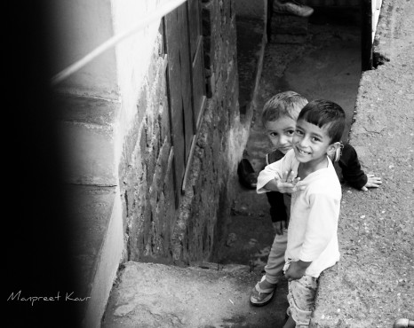
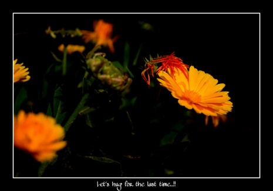

Hey People...!

I am Manpreet Kaur, a 23 year old Master's student of structural Engineering. I have done my Graduation from 
Guru Nanak Dev Engineering College, Ludhiana and I am doing my Post Graduation also from the same college. I have
choose civil engineering as my option for graduation because I don't want to go for computer science engineering 
(the other choice), as I HATE coding at that time. But, now I am learning python. Sometimes I think that this is 
the beauty of life, it is full of surprises.

#**My Interests**

So, this a bit technical/professional part of my about. The other part is that I got other area of interests too. I love to do
*Street and landscape photography
*Calligraphy
*Travelling at night.

I got some assignments for photography that went well. I am sharing some of pictures clicked by me. Please have a look. 

                                                              

##**My favourites**

When It comes to Street photography, no one can beat steave mccury. He is my favourite photographer. The first video of his work that I watched
[Click me!](https://youtu.be/7ZVyNjKSr0M)

Writers
*Harpal singh Pannu
*Jaswant Zafar
*Harmanjeet

I got appreciation and awards for story writing and calligraphy at college and inter college level.
Whatever I have attempted, it went well. Maybe this is the reason that I always remained confused that what I actually want to do.
But at this time all other things are on standby as I am focussing only on my master's. 

At last I want to say that One has to make plans but never expect that they got fulfilled in the same way
as we have thought. God always have Great plans for you.

Thanks.